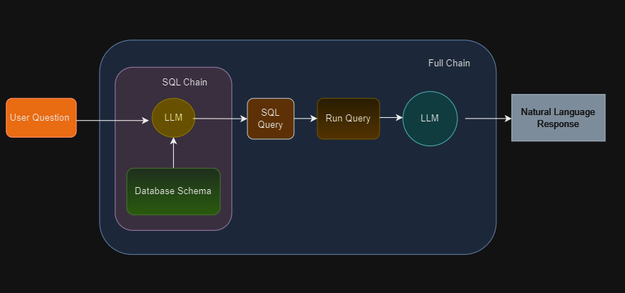

# LangChain: Connecting to MySQL and MongoDB

This repository demonstrates how to use LangChain to interact with both MySQL and MongoDB databases. The integration allows seamless query generation and retrieval of data from these databases using natural language inputs.



---

## Features

- **Natural Language Querying:** Use LangChain to generate SQL queries for MySQL and queries for MongoDB.
- **Dual Database Support:** Seamlessly connect and interact with both relational (MySQL) and non-relational (MongoDB) databases.
- **Customizable:** Easily extend the scripts for additional functionality or databases.

---

## Prerequisites

1. **Python 3.7+**
2. **Databases:** Ensure you have access to:
   - A MySQL database instance.
   - A MongoDB database instance.
3. **Required Python Libraries:** Install the following:
   - `mysql-connector-python`
   - `pymongo`
   - `langchain`

```bash
pip install mysql-connector-python pymongo langchain
```

---

## Setting Up the Test Database

In this section, we'll set up the database. This is a sample database that represents a digital media store, including tables for artists, albums, media tracks, invoices, and customers. We will use this database to test our chatbot.

---

## Usage

### Install the Required Python Libraries

Install the necessary Python libraries using pip:

```bash
pip install langchain mysql-connector-python
```
